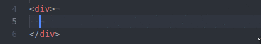
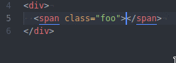
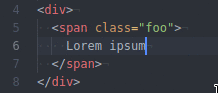

# smart-html-tags package

This package intends to implement a collection of tiny features making typing
HTML / XML more easier.

The code is written from scratch; this package is not a fork of any other poor
implementation. All bugs are my own.

Every feature can be turned on/off separately in case that one wishes to use
another package for that behavior.

## Features
- Insert ending tag automatically upon completing the opening tag.
- Insert an indentation block when user presses Enter while between open and close
  tags.
- Automatically rename the corresponding tag also when editing the other side.

## Examples

### Tag auto complete

### Indentation block between open/close tags

### Synchronized tag renaming

